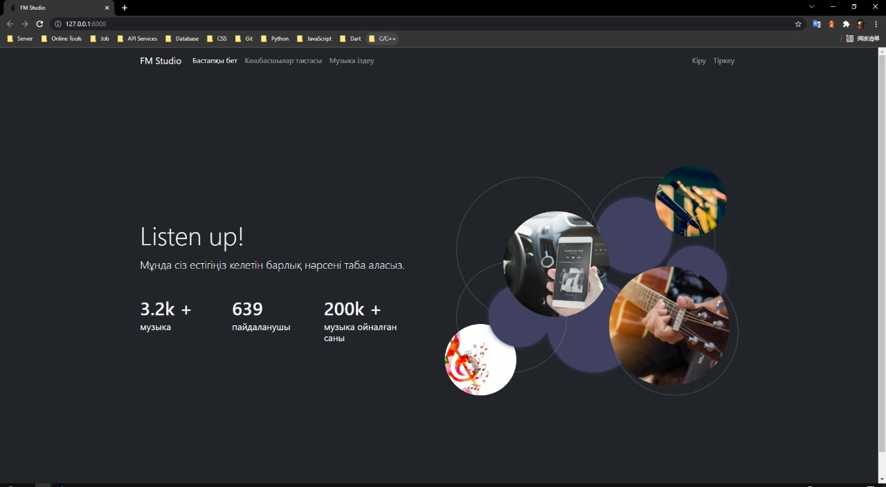
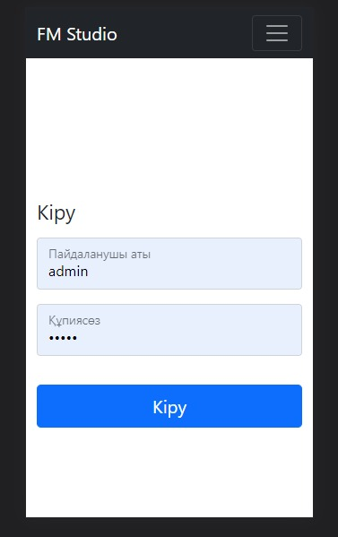
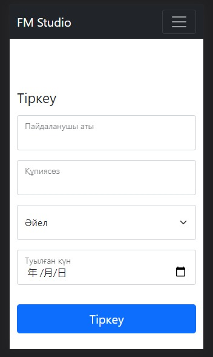

# Django3 + Vue3 全栈项目 (音乐平台)

> 某同学的毕业设计作品, 想写一个 Django 全栈的项目, 回忆一下大二时候的自己.

> 因为时间关系暂时只做了部分功能, 但是有空会继续更新的

---

## 项目配置

- Python 3.9.6
- Django 3.2.8
- SQLite3

---

## 运行项目

- 代码克隆到本地: `git clone https://github.com/YernarT/fm_studio.git`

- 安装依赖: 进入项目根目录, 命令行工具输入`pip install -r requirements.txt`

- 运行 Django 端服务器: `python manage.py runserver`, 打开`http://localhost:8000` 即可预览项目

---

## 项目结构

未准备...

---

## 技术栈

### 前端: Vue3, Bootstrap5

### 后端: Django3

### 数据库: SQLite

---

## 功能

### 音乐播放: 包括播放进度条, 播放动画, 歌曲切换

### 登录注册: 登录, 注册, 修改个人信息

### 歌曲搜索: 通过歌曲名称, 演唱者名字, 歌词模糊查询

---

## 在线演示及项目地址

### 在线演示地址: xxx.html

### github 地址: hhttps://github.com/YernarT/fm_studio

---

## 项目截图

### 首页

### 登录页面

### 注册页面

