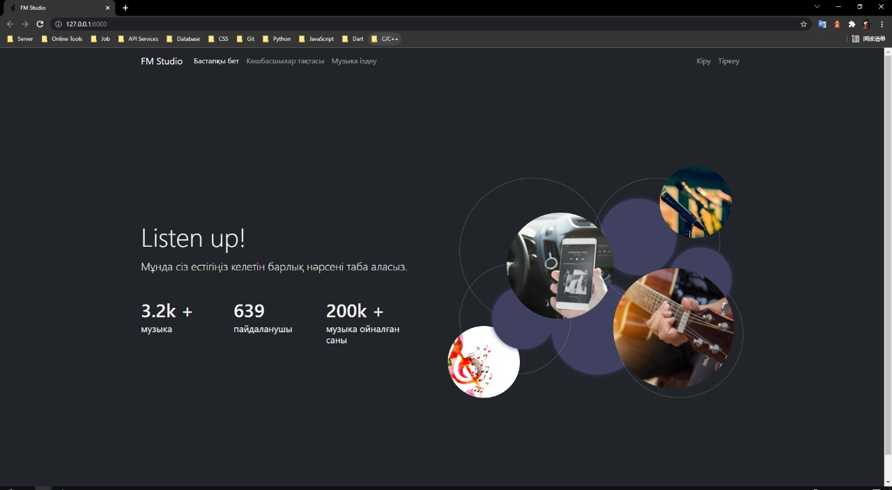

# Django3 + Vue3 全栈项目 (音乐平台)

> 2021 年 ~ 2022 年, 大学四年纪, 班里同学(Rapper Жандос)的毕设。整体代码比较拉跨, 后端用的是 Django 原生 View 开发, 前端用的是刚学没多久的 Vue.js。还邀请了一些朋友(contributors)一同开发 :)

---

## 运行项目

1. 代码克隆到本地: `git clone https://github.com/YernarT/fm_studio.git`

2. 安装依赖: 进入项目根目录, 命令行工具输入 `pip install -r requirements.txt`

3. 运行 `Django` 端服务器: `python manage.py runserver`

4. 从浏览器打开 `http://localhost:8000` 浏览

---

## 技术选型

### 前端: `Vue3.2`

### 后端: `Python 3.9.6` `Django 3.2.8`

### 数据库: `SQLite`

---

## 功能

### 播放音乐: 全局播放进度条, 歌曲切换

### 用户授权: 登录, 注册, 修改个人信息

### 歌曲搜索: 通过歌曲名称, 演唱者名字, 歌词模糊查询

---

## 在线演示

### 在线演示地址: 未准备...

---

## 项目截图

### 首页 (旧版)

